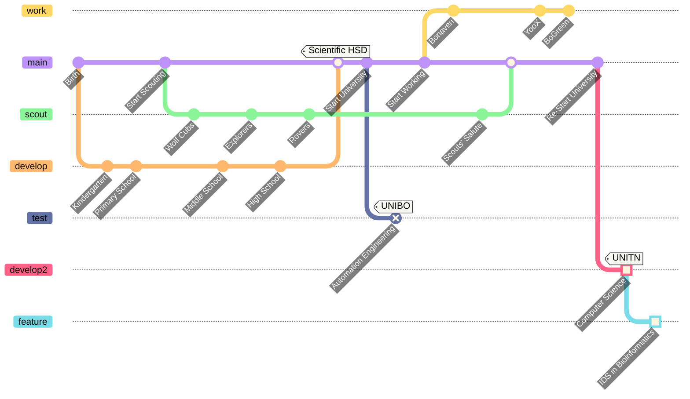

## `Hello World\n`

- 👋 Hi, I’m @isacchetto
- 🌱 I’m currently learning Computer Science💻 with an interdisciplinary course in Bioinformatics🧬
- 🏔 I’m interested in hiking and the mountain sport in general
- 🏕 I'm a scout
- 🤓 I'm a little nerd
- 💞️ I’m looking to collaborate on @LorenzoMase and @dalmasluca
- 💔 I'm actually collaborating with @armyalpaca but I would like to change ☝️
- 🤔 I'm looking for help with Rust
- 🌐 [My Website](https://www.youtube.com/watch?v=dQw4w9WgXcQ&ab_channel=RickAstley "isacchetto-Website")

<!---
isacchetto/isacchetto is a ✨ special ✨ repository because its `README.md` (this file) appears on your GitHub profile.
You can click the Preview link to take a look at your changes.
--->
